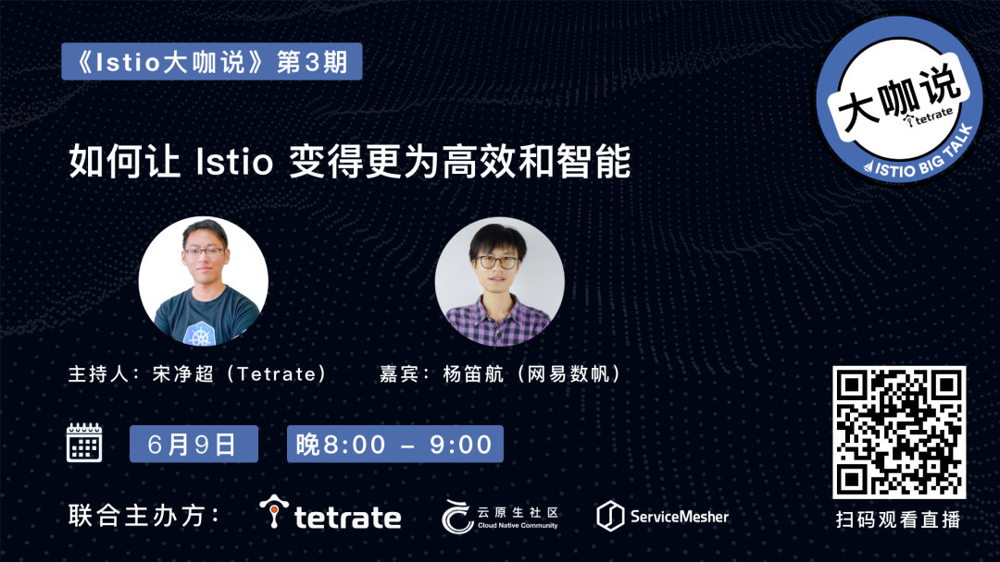

- 时间：6 月 9 日（星期三）晚 8 点 - 9 点
- 直播间：<https://live.bilibili.com/23095515>
- 主持人：宋净超（Tetrate）
- 嘉宾：杨笛航（网易数帆）
- 话题：如何让 Istio 变得更为高效和智能
- 直播回放：<https://www.bilibili.com/video/BV18o4y1y75e/>
- 幻灯片归档：[GitHub](https://github.com/tetratelabs/istio-weekly/blob/main/istio-big-talk/003/istio-big-talk-slide-003.pdf)

## 嘉宾简介

杨笛航，Istio 社区成员，网易数帆架构师，负责网易轻舟 Service Mesh 配置管理，并主导 Slime 组件设计与研发，参与网易严选和网易传媒的 Service Mesh 建设。具有三年 Istio 控制面功能拓展和性能优化经验。



## 话题介绍

Istio 作为当前最火的 Service Mesh 框架，既有大厂背书，也有优秀的设计，及活跃的社区。但是随着 Mixer 组件的移除，我们无法通过扩展 mixer adapter 的方式实现高阶的流量管理功能，Istio 的接口扩展性成为亟待解决的问题。本次直播将分享本次分享将介绍网易自研的智能网格管理器 Slime，借助它，我们实现了配置懒加载，自适应限流，HTTP 插件管理等扩展功能，从而更为高效的使用 Istio。

## 听众收益

- 了解在实际业务中驾驭 Istio 框架的挑战
- 了解 Slime 的设计特点、技术路线及开源进展
- 了解网易解决 Service Mesh 架构成熟的经验

## 问答

1. Slime 兼容什么版本的 Istio？

   答：1.3 以后的版本都可以，网易内部使用 1.3 和 1.7 版本。

2. 请问对于 Slime 的懒加载功能，在初始的时候是否可能存在 “冷启动”（刚开始 fence 里的服务较少，大多数依赖如果需要从兜底路由拉取需两次代理）。a) 能不能在刚开始的时候在 fence 里把所有 service 都写上（相当于配置信息全量下发），每次被调用到的服务放到 fence 的前面，等几轮全量下发配置之后将 fence 里排在后面的 service，类似于 LRU 算法）删除，这样可不可以减少两次代理的次数。b) 或者在开始前分析最近的流量关系，得到一个初始的 fence 状态。

   答：a) 可以在 fence 里手动配置，也可以当做 SidecarScope 资源来用，例如已经确定了 a 到 b 的调用关系，那么可以使用如下配置作为 a 的 servicefence：

   ```yaml
   apiVersion: microservice.netease.com/v1alpha1
   kind: ServiceFence
   metadata:
     name: a
     namespace: test1
   spec:
     enable: true
     host:
       b.test1.svc.cluster.local:
         stable: {}
   ```

   b) 可以有类似的做法，例如可以开启配置懒加载在测试环境运行一段时间，得到 fence 的初始状态然后放到线上环境去使用。

3. 如果想给 Istio 添加更多的负载均衡策略，能否通过添加 CRD 的方式，或者通过 wasm 拓展 envoy？

   答：Slime 主要是做控制平面的扩展，负载均衡策略可能要通过 Envoy 来扩展。

4. 有什么办法能让两个服务均在网格之中，但在他们双发调用时流量不经过 proxy 而直接访问？

   答：动态修改 iptables。

5. 协议：有什么办法能实现满足支持其他 RPC 协议，如 thrift 和其他私有 RPC？

   答：Envoy 已经支持 Thrift 和 Dubbo 协议，但是不能比较好的路由和流量管理，可以研究下开源项目 Aeraki。

6. 写 SmartLimiter CRD 时，ratelimite 是如何渲染成 EnvoyFilter 的，在数据面要做些什么工作？

   答：EnvoyFilter 的作用是将某一段配置插入到 xds 中的某块位置，实现 ratelimite 的功能就是要把 ratelimite 的相关配置插入到 rds 中 host 级别 /route 级别的 perfilterconfig 中。因而我们可以基于一个固定的模版去渲染 EnvoyFilter。目前自适应限流是基于 envoy 官方的限流插件的，不需要数据面做额外的工作。

7. 第一次访问为什么会走到 global sidecar？

   答：第一次访问还没有服务依赖拓扑，调用者没用被调用者的服务发现和路由信息，需要 global sidecar 作为兜底代理

8. EnvoyFilter 有执行顺序吗，比如设置了 RequestAuthentication 和 AuthorizationPolicy，在 filter 里面有执行顺序吗？

   答：LDS 中的插件次序就是执行顺序。

9. Sidecar 和 应用容器的启动顺序，一定是 sidecar 先启动吗？

   答：在安装时开启 holdApplicationUntilProxyStarts 可以确保 sidecar 容器先启动（Istio 1.7 +）。